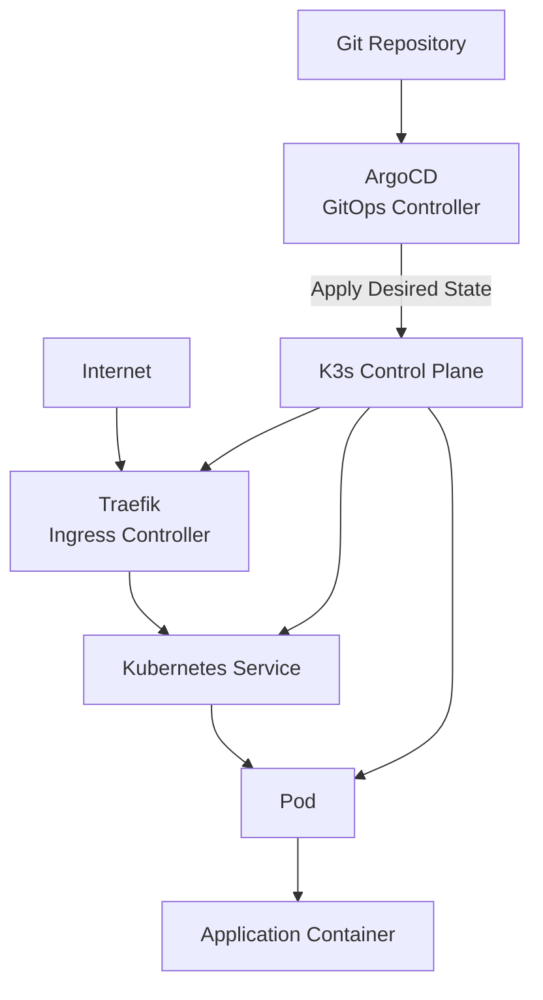

# Home Kubernetes Platform

A lightweight self-hosted GitOps platform running on Oracle Cloud Free Tier using K3s and ArgoCD.

## Current Scope

This repository currently demonstrates:

- K3s multi-node cluster
- GitOps workflow using ArgoCD
- Declarative infrastructure management
- Application deployment through Kubernetes manifests
- HTTPS certificate management with cert-manager
- Secret management with Sealed Secrets
- In-cluster ingress routing
- Repository organization for infrastructure and applications

Future work may include:

- Monitoring (Prometheus + Grafana)
- Centralized logging
- Persistent storage
- Infrastructure provisioning with Terraform
- CI/CD pipeline integration
- High Availability control plane

---

## Architecture



---

## Repository Structure

```text
bootstrap/
    Bootstraps ArgoCD and root applications.

cluster-tools/
    Shared cluster-level components such as cert-manager and Sealed Secrets.

apps/
    User applications managed by ArgoCD.

README.md
    Project overview.

SEALED_SECRETS.md
    Notes about secret management.
```

---

## GitOps Workflow

```
Developer
      │
      ▼
Git Commit
      │
      ▼
Git Repository
      │
      ▼
ArgoCD
      │
      ▼
Kubernetes API
      │
      ▼
Deployments / Services / Pods
```

The Git repository is treated as the single source of truth.

Infrastructure changes are made through Git commits instead of manual cluster modifications.

---

## Responsibility Overview

| Component | Responsibility |
|-----------|----------------|
| Git | Desired state |
| ArgoCD | Synchronizes desired state with the cluster |
| K3s | Runs the Kubernetes cluster |
| Deployment | Maintains application replicas |
| Service | Service discovery and load balancing |
| Traefik | HTTP/HTTPS ingress routing |
| cert-manager | TLS certificate automation |
| Sealed Secrets | Secure secret storage in Git |
